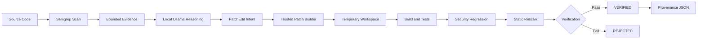

# AIKavach CRS

AIKavach CRS is a local Cyber Reasoning System built around a simple loop:

**Find -> Reason -> Patch -> Verify**

The current MVP scans a repository for a known vulnerability pattern, uses a local Ollama model to reason about the finding, generates a constrained edit, builds the patch in trusted code, and verifies the result in a temporary workspace.

The model does not get the final say. A patch is accepted only if verification passes.

## Architecture



The LLM is used for reasoning and constrained edit intent. Patch construction and final approval remain outside the model boundary.

## What works today

- Semgrep-based static analysis
- Local Ollama reasoning (`qwen2.5-coder:3b` used for the demo)
- Bounded evidence passed to the model
- Minimal `PatchEdit` output from the model
- Deterministic unified-diff construction in CRS code
- Patch application in an isolated temporary copy
- Build/test/security regression/static rescan checks
- Fail-closed `VERIFIED` / `REJECTED` decision
- JSON provenance record with repository and patch SHA-256 hashes

The original repository is not modified during verification.

## Setup

Requires Python 3.11 or newer.

```bash
python -m pip install -r requirements.txt
python -m pytest -q
```

For the local model, run Ollama and set:

```text
AIKAVACH_LLM_PROVIDER=ollama
AIKAVACH_OLLAMA_URL=http://127.0.0.1:11434
AIKAVACH_OLLAMA_MODEL=qwen2.5-coder:3b
AIKAVACH_OLLAMA_TIMEOUT=180
```

## Demo

Run the command-injection sample:

```bash
python -m crs.demo samples/vulnerable/command_injection
```

A successful run goes through all four stages and ends with:

```text
FINAL DECISION : VERIFIED
ORIGINAL REPOSITORY MODIFIED : NO
```

It also writes the latest audit record to:

```text
artifacts/latest_run.json
```

## Verification

The final decision is based on the verification harness, not model confidence. The current checks are:

1. Build
2. Tests
3. Security regression
4. Static rescan

If verification cannot establish that the candidate patch is safe, the run is rejected.

## Project status

The core MVP is working end to end and the test suite currently contains 122 passing tests.

Planned later-stage work includes dynamic analysis, coverage-guided fuzzing, autonomous red-team validation, mission-impact analysis, vulnerability knowledge graphs, and stronger formal/provenance mechanisms. These are roadmap items, not part of the current MVP.
